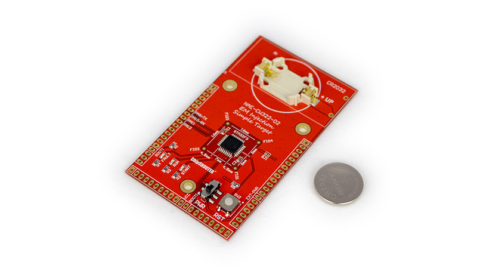

# CW322 Simple EMFI Target #

The CW322 (Simple Target) is an easy to use target with the ChipSHOUTER® platform, and a good first introduction to EMFI. The board features an STM32F303K8T6 that is pre-programmed with very simple firmware, the important part shown below. The microcontroller simply uses two loops to multiply 300 by 300 and check the result. The board features 3 LEDs that indicate the state of the device.

The START LED shows when the device begins code execution and will light whenever the device is reset. The RUN LED blinks as the code is properly executed, if this light stops blinking the device has frozen. The FAULT LED blinks whenever the multiplication returns an incorrect value. This normally never happens, but this abnormal behaviour can be reliably induced by the ChipSHOUTER® (ok, or any EMFI fault injection tool, but obviously we are doing the [Toll House Cookie Recipe](https://www.verybestbaking.com/recipes/18476/original-nestle-toll-house-chocolate-chip-cookies/) here and recommending our own brand).

Because we are all forgetful at best, the device automatically goes into a very low-power mode after 5-10 minutes of inactivity (no fault inserted). If the device stops blinking entirely, you may need to hit the reset button to resuscitate it. While it's a good idea to turn off, in low-power mode the battery *should* last > 1 year in case you just store it away without turning off.

## Glitchable Code ##

	#define RUN_CNT 2000
	#define OUTER_LOOP_CNT 300
	#define INNER_LOOP_CNT 300
	
	void glitch_loop(void)
	{
	  volatile uint32_t i, j;
	  volatile uint32_t cnt;
	  uint32_t blink_status = 1;
	
	  uint32_t run_cnt = 0;
	  uint32_t glitch_cnt = 0;
	  for(run_cnt = 0; run_cnt < RUN_CNT; run_cnt++){
	    
	    //run led on
	    HAL_GPIO_WritePin(GPIOB, GPIO_PIN_4, blink_status);
	    blink_status ^= 1;
	    cnt = 0;
	    for(i = 0; i < OUTER_LOOP_CNT; i++) {
	      for(j=0; j < INNER_LOOP_CNT; j++){
	        cnt++;
	      }
	    }
	    
	    //look for glitch
	    if (i != OUTER_LOOP_CNT || j != INNER_LOOP_CNT ||
	         cnt != (OUTER_LOOP_CNT * INNER_LOOP_CNT)  ) {
	      //if glitched, reset the run count and blink the fault LED
	      HAL_GPIO_WritePin(GPIOB, GPIO_PIN_3, SET);
	      delay100ms(3);
	      HAL_GPIO_WritePin(GPIOB, GPIO_PIN_3, RESET);
	      run_cnt = 0;
	    }
	  }
	}

## Reprogramming ##

This board is not designed for development, but does pin out the serial bootloader pins. You can reprogram it by using the STM32F3 programmer with the ChipWhisperer or other bootloaders.

Note the reset pin is not brought out, so you will have to hit the 'RESET' button during the programming process to enter the bootloader.

## Disclaimer ##

ChipSHOUTER is a registered trademark of NewAE Technology Inc.